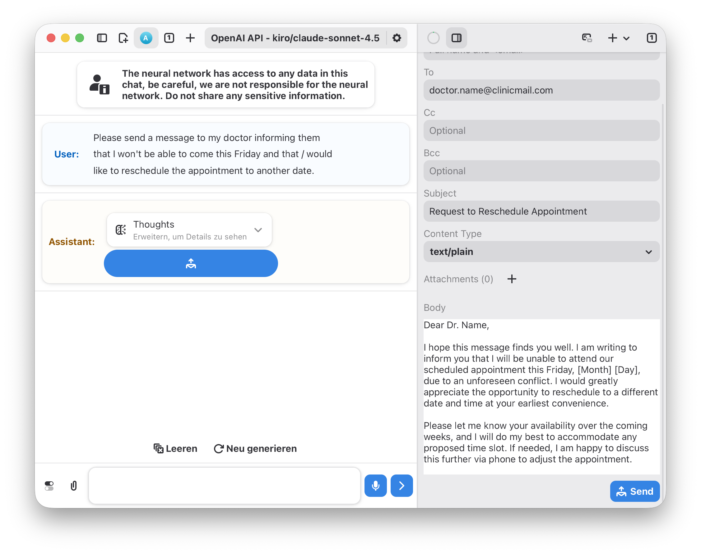

<h1 align="center">
  
  <br>
  Newelle - Your Ultimate Virtual Assistant
</h1>
<p align="center">
    <a href="https://github.com/topics/newelle-extension">
      <picture>
        <source srcset="https://raw.githubusercontent.com/qwersyk/Assets/main/newelle-extension.svg" media="(prefers-color-scheme: light)">
        <source srcset="https://raw.githubusercontent.com/qwersyk/Assets/main/newelle-extension-dark.svg" media="(prefers-color-scheme: dark)">
        
      </picture>
    </a>
    <a href="https://github.com/qwersyk/Newelle/wiki">
      <picture>
        <source srcset="https://raw.githubusercontent.com/qwersyk/Assets/main/newelle-wiki.svg" media="(prefers-color-scheme: light)">
        <source srcset="https://raw.githubusercontent.com/qwersyk/Assets/main/newelle-wiki-dark.svg" media="(prefers-color-scheme: dark)">
        
      </picture>
    </a>
	<a href="https://newelle.qsk.me/discord">
      <picture>
        <source srcset="https://raw.githubusercontent.com/qwersyk/Assets/main/discord.svg" media="(prefers-color-scheme: light)">
        <source srcset="https://raw.githubusercontent.com/qwersyk/Assets/main/discord-dark.svg" media="(prefers-color-scheme: dark)">
        
      </picture>
    </a>
    <br>
</p>

<picture>
  <source srcset="screenshots/macos.png" media="(prefers-color-scheme: light)">
  <source srcset="screenshots/macos_b.png" media="(prefers-color-scheme: dark)">
  
</picture>

# Installation

Build from source on macOS:

```bash
/usr/bin/env bash macos/build_newelle_dmg.sh
```
